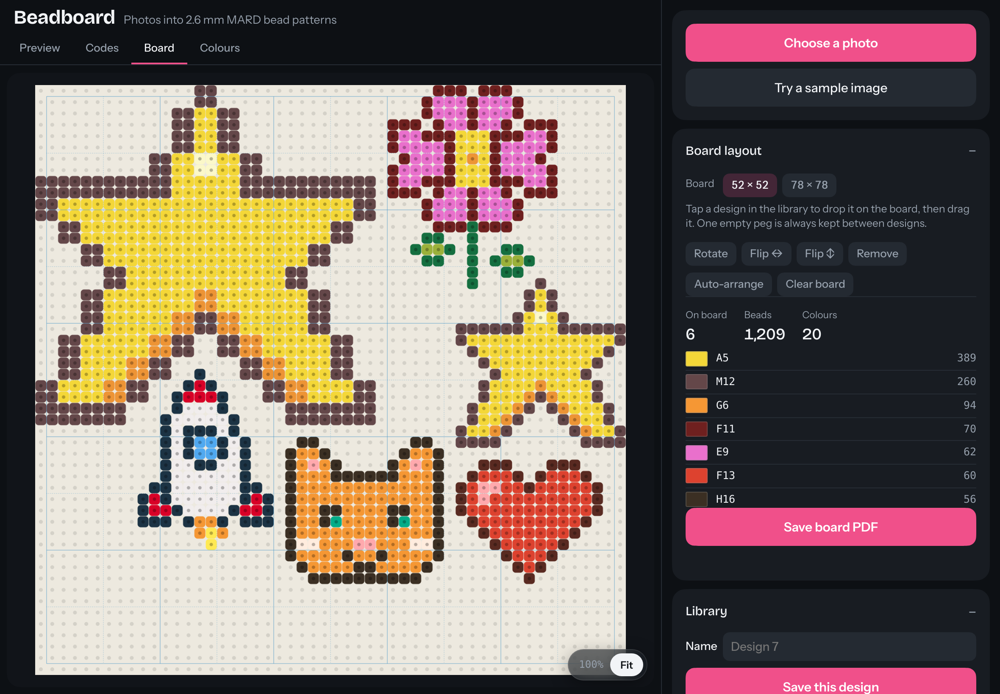

# Beadboard

Turn photos and pixel art into 2.6 mm fuse bead patterns, coded to the 221-colour MARD palette. An installable, offline web app for iPad and iPhone, built for making bead art with kids.

**[Open Beadboard →](https://galonce.github.io/Beadboard/)**

## What it does

- **Photos to patterns.** Colours are matched perceptually, in OKLab rather than RGB, so skin tones and shadows hold together. A Simplify control merges colours used only a handful of times, so there are fewer bags to open.
- **Pixel art, exactly.** Small images map one pixel to one bead, every source colour gets its own bead, and transparent pixels stay as empty pegs.
- **Sprite sheets.** Pick a single frame from a sheet, with frame-size and grid-offset controls for sheets packed without padding.
- **Background removal.** Clear everything touching the edges in one tap, or erase by area, by bead or by colour.
- **Colour swaps.** Tap any bead to replace its colour, with the closest alternatives offered first.
- **Pegboard layouts.** Save designs to a library and arrange several on one board. An empty peg is always kept between designs so they don't fuse together, and the whole board gets one combined bead list.
- **Charts to work from.** An on-screen code chart and a single-page vector PDF, drawn with the same guides as a printed pegboard: a solid line every 10 pegs, dashed every 5.
- **Colour calibration.** Adjust any colour to match your actual beads, behind a parent PIN.

## Install on iPad or iPhone

1. Open the link above in **Safari**
2. Tap **Share**, then **Add to Home Screen**
3. Open it once while online. After that it works with no connection

Designs and colour adjustments are stored on each device. Use **Export** and **Import** in the Library to move them between devices.

## Maintaining it

**Updating the app.** Replace `index.html`, then change `CACHE` in `sw.js` to the next version number, for example `beadboard-v14` to `beadboard-v15`. Without the bump, installed copies keep serving the old version from their offline cache. Reopen the app while online to pick up the change.

**Replacing the icons.** Swap these files, keeping the exact names and pixel sizes:

| File | Size | Used for |
| --- | --- | --- |
| `icon-180.png` | 180 × 180 | iPhone and iPad home screen |
| `icon-192.png` | 192 × 192 | Browser tab, Android |
| `icon-512.png` | 512 × 512 | Android, install screens |
| `icon-maskable-512.png` | 512 × 512 | Android adaptive icon |

`icon-180.png` and `icon-maskable-512.png` must be opaque, full-bleed squares with no rounded corners: the system applies its own shape, and iOS turns transparent pixels black. Keep the maskable icon's artwork inside the central 80% circle. After swapping, bump `CACHE` as above, then delete the home-screen shortcut and add it again, since iOS keeps old icons until then.

## Credits

- Colour values from the [MARD bead colour chart](https://www.pixel-beads.com/mard-bead-color-chart). They are screen approximations, and dye lots vary, which is what the calibration is for.
- PDF export by [jsPDF](https://github.com/parallax/jsPDF), MIT licence.
- Typefaces: Bricolage Grotesque and Instrument Sans, via Google Fonts.

© 2026 Gal. All rights reserved.
